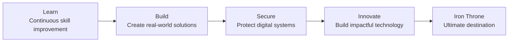

# CyberStark-Rohith

### Sentinel of the Digital North

`AI Engineer` | `Cyber Security Enthusiast` | `MLOps Explorer` | `Linux Engineer` | `Full Stack Builder`

 

<table>
  <tr>
    <td width="25%" align="center">
      <h3>AI Engineer</h3>
      
Building intelligent systems with AI/ML

    </td>
    <td width="25%" align="center">
      <h3>Cyber Security</h3>
      
Securing systems and hunting digital threats

    </td>
    <td width="25%" align="center">
      <h3>MLOps Explorer</h3>
      
Automating, deploying, and scaling ML models

    </td>
    <td width="25%" align="center">
      <h3>Full Stack Builder</h3>
      
Turning ideas into complete solutions

    </td>
  </tr>
</table>

> Chaos isn't a pit. Chaos is a ladder.  
> Every commit is another step toward the Iron Throne.

## About Me

Passionate developer exploring Artificial Intelligence, Cyber Security, MLOps, Linux, and Full Stack Development.

Building secure, intelligent, and scalable solutions that solve real-world problems.

**The North Remembers. The Code Endures.**

  

## Featured Repositories

<table>
  <tr>
    <td width="50%">
      <h3><a href="https://github.com/cyberstark-rohith/Ransomware-project">Ransomware-project</a></h3>
      
Ransomware Detection Using Machine Learning Pipeline

      
      
    </td>
    <td width="50%">
      <h3><a href="https://github.com/cyberstark-rohith/linux-commands">linux-commands</a></h3>
      
Collection of useful Linux commands and learning resources

      
      
    </td>
  </tr>
  <tr>
    <td width="50%">
      <h3><a href="https://github.com/cyberstark-rohith/MLOPS">MLOPS</a></h3>
      
MLOps workflow, deployment, monitoring, and automation

      
      
    </td>
    <td width="50%">
      <h3><a href="https://github.com/cyberstark-rohith/Securehire-AI">Securehire-AI</a></h3>
      
AI-powered hiring intelligence and fraud detection platform

      
      
    </td>
  </tr>
  <tr>
    <td width="50%">
      <h3><a href="https://github.com/cyberstark-rohith/threatlens-ai">threatlens-ai</a></h3>
      
AI-powered threat intelligence and cyber analysis system

      
      
    </td>
    <td width="50%">
      <h3><a href="https://github.com/cyberstark-rohith/Ai-travel-manager">Ai-travel-manager</a></h3>
      
Smart AI travel planning and recommendation system

      
      
    </td>
  </tr>
</table>

## Tech Stack

<table>
  <tr>
    <td width="50%">
      <h3>Languages</h3>
      

        
         
        
      

    </td>
    <td width="50%">
      <h3>AI & Machine Learning</h3>
      

        
         
        
        
      

    </td>
  </tr>
  <tr>
    <td width="50%">
      <h3>Web Development</h3>
      

        
      

    </td>
    <td width="50%">
      <h3>Tools & DevOps</h3>
      

        
      

    </td>
  </tr>
  <tr>
    <td width="50%">
      <h3>Cloud Platforms</h3>
      

        
      

    </td>
    <td width="50%">
      <h3>Databases</h3>
      

        
      

    </td>
  </tr>
</table>

## GitHub Stats

 

 

<table>
  <tr>
    <td align="center"><b>Total Contributions</b> </td>
    <td align="center"><b>Total Commits</b> </td>
    <td align="center"><b>Public Repositories</b> </td>
    <td align="center"><b>Technology Usage</b> </td>
  </tr>
</table>

## Interests

  
  
  
  
  
  
  
  

## Current Focus

<table>
  <tr>
    <td>
      <h3>Futuristic Build Checklist</h3>
      
✔ Advanced Deep Learning

      
✔ Cyber Security Research

      
✔ MLOps & Model Deployment

      
✔ SecureHire-AI Development

      
✔ Open Source Contributions

    </td>
  </tr>
</table>

## The Road Ahead

## Connect

| Platform | Link |
| --- | --- |
| GitHub | [github.com/cyberstark-rohith](https://github.com/cyberstark-rohith) |
| LinkedIn | [linkedin.com/in/cyberstark-rohith](https://linkedin.com/in/cyberstark-rohith) |
| Email | [rohithbusiness2004@gmail.com](mailto:rohithbusiness2004@gmail.com) |

 

> The North Remembers.  
> The Code Endures.  
> Winter is Coming. The Code is Here.

