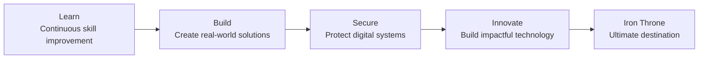

<!--
  GitHub Profile README for CyberStark-Rohith
  Theme: GoT-inspired CyberStark — dark arctic/midnight with ice-blue signals.
  Structure: Elaborate cinematic style with typing SVG, banners, badges, and stats.
-->

<div align="center">


<a href="https://git.io/typing-svg">
  
</a>

<br />
<br />


<br />
<br />

<table>
  <tr>
    <td align="center" width="33%">
      
      <br />
      <strong>CyberStark-Rohith</strong>
      <br />
      <sub>Sentinel of the Digital North</sub>
    </td>
    <td align="center" width="34%">
      
      <br />
      <br />
      <strong>GoT-inspired systems thinker</strong>
      <br />
      <sub>Security, full stack products, AI workflows, and clean UX.</sub>
    </td>
    <td align="center" width="33%">
      
      <br />
      <br />
      <strong>AI × Cyber Security</strong>
      <br />
      <sub>ML pipelines, threat analysis, MLOps, and open source.</sub>
    </td>
  </tr>
</table>

<br />


</div>

## 

<table>
  <tr>
    <td width="42%" align="center" valign="middle">
      
      <br />
      <br />
      <strong>CyberStark-Rohith</strong>
      <br />
      <sub>@cyberstark-rohith</sub>
      <br />
      <br />
      
      <br />
      
      <br />
      
    </td>
    <td width="58%" valign="top">
      <h3>Mission Console</h3>
      <p>
        I build secure, intelligent, and scalable software across AI/ML pipelines,
        full stack products, MLOps workflows, cyber security labs, and open source systems.
      </p>
      <table>
        <tr>
          <td align="center"><strong>AI Systems</strong><br /><sub>Deep learning, NLP, vision</sub></td>
          <td align="center"><strong>Cyber Labs</strong><br /><sub>Threat intel, analysis, CTFs</sub></td>
          <td align="center"><strong>MLOps</strong><br /><sub>Deploy, monitor, automate</sub></td>
        </tr>
        <tr>
          <td align="center"><strong>Full Stack</strong><br /><sub>React, Node, APIs</sub></td>
          <td align="center"><strong>Cloud</strong><br /><sub>GCP, Firebase, containers</sub></td>
          <td align="center"><strong>Mindset</strong><br /><sub>Build, secure, innovate</sub></td>
        </tr>
      </table>
      <p>
        
        
        
      </p>
    </td>
  </tr>
</table>

<div align="center">
  
</div>

## 

<table>
  <tr>
    <td width="50%" valign="top">
      <h3><a href="https://github.com/cyberstark-rohith/Securehire-AI">Securehire-AI</a></h3>
      <p>
        AI-powered hiring intelligence and fraud detection platform.
        Combines ML models with smart screening, anomaly detection,
        and bias-aware recruitment workflows.
      </p>
      <p>
        
        
        
      </p>
      <p>
        
      </p>
    </td>
    <td width="50%" valign="top">
      <h3><a href="https://github.com/cyberstark-rohith/threatlens-ai">ThreatLens-AI</a></h3>
      <p>
        AI-powered threat intelligence and cyber analysis system.
        Analyzes threat patterns, surfaces intelligence signals,
        and supports security investigation workflows.
      </p>
      <p>
        
        
        
      </p>
      <p>
        
      </p>
    </td>
  </tr>
  <tr>
    <td width="50%" valign="top">
      <h3><a href="https://github.com/cyberstark-rohith/Ransomware-project">Ransomware-project</a></h3>
      <p>
        Ransomware detection using a machine learning pipeline.
        Feature extraction from file behavior, classification models,
        and detection reporting for security research.
      </p>
      <p>
        
        
      </p>
      <p>
        
      </p>
    </td>
    <td width="50%" valign="top">
      <h3><a href="https://github.com/cyberstark-rohith/Ai-travel-manager">AI Travel Manager</a></h3>
      <p>
        Smart AI travel planning and recommendation system.
        Generates personalized itineraries, budget breakdowns,
        and destination suggestions with intelligent context.
      </p>
      <p>
        
        
      </p>
      <p>
        
      </p>
    </td>
  </tr>
  <tr>
    <td colspan="2" valign="top">
      <h3><a href="https://github.com/cyberstark-rohith/MLOPS">MLOps Pipeline</a></h3>
      <p>
        End-to-end MLOps workflow covering model training, containerized deployment,
        monitoring, CI/CD automation, and scalable serving infrastructure.
      </p>
      <p>
        
        
        
      </p>
      <p>
        
        
        
      </p>
    </td>
  </tr>
</table>

<div align="center">
  
</div>

## 

<table>
  <tr>
    <td align="center" width="33%">
      <strong>Languages</strong>
      <br />
      <br />
      
      <br />
      <sub>Logic, scripting, systems thinking, and application code.</sub>
    </td>
    <td align="center" width="33%">
      <strong>AI &amp; Machine Learning</strong>
      <br />
      <br />
      
      <br />
      
      
      <br />
      <sub>Deep learning, NLP, computer vision, model pipelines.</sub>
    </td>
    <td align="center" width="33%">
      <strong>Web Development</strong>
      <br />
      <br />
      
      <br />
      <sub>Responsive interfaces and backend APIs.</sub>
    </td>
  </tr>
  <tr>
    <td align="center" width="33%">
      <strong>Cyber Security</strong>
      <br />
      <br />
      
      
      
      <br />
      <sub>Traffic analysis, web testing, and threat investigation.</sub>
    </td>
    <td align="center" width="33%">
      <strong>Tools &amp; DevOps</strong>
      <br />
      <br />
      
      <br />
      <sub>Version control, containers, and delivery workflows.</sub>
    </td>
    <td align="center" width="33%">
      <strong>Cloud &amp; Databases</strong>
      <br />
      <br />
      
      <br />
      
      <br />
      <sub>Cloud platforms and relational/document databases.</sub>
    </td>
  </tr>
</table>

## 

<div align="center">

<table>
  <tr>
    <td width="50%">
      
    </td>
    <td width="50%">
      
    </td>
  </tr>
  <tr>
    <td colspan="2">
      
    </td>
  </tr>
  <tr>
    <td colspan="2">
      
    </td>
  </tr>
  <tr>
    <td colspan="2">
      
    </td>
  </tr>
</table>

<br />


<br />

</div>

## 

<p align="center">
  
  
  
  
  
  
  
  
</p>

## 

<table>
  <tr>
    <td width="20%" align="center"><strong>01</strong><br /><sub>Learn continuously</sub></td>
    <td width="20%" align="center"><strong>02</strong><br /><sub>Build real solutions</sub></td>
    <td width="20%" align="center"><strong>03</strong><br /><sub>Secure every surface</sub></td>
    <td width="20%" align="center"><strong>04</strong><br /><sub>Automate and scale</sub></td>
    <td width="20%" align="center"><strong>05</strong><br /><sub>Ship and improve</sub></td>
  </tr>
</table>

<details>
  <summary><strong>Open the build philosophy console</strong></summary>
  <br />

```text
> scan --systems
  Understand the data path, threat surface, failure modes, and user journey.

> train --models
  Build reliable ML pipelines with clean features, validation, and monitoring.

> secure --api
  Validate inputs, protect routes, reduce exposed secrets, and respect roles.

> deploy --mlops
  Containerize, automate CI/CD, monitor drift, and iterate fast.

> learn --loop
  Build, test, document, ask better questions, repeat.
```

</details>

## 

<table>
  <tr>
    <td>
      <h3>Futuristic Build Checklist</h3>
      <p>✔ Advanced Deep Learning</p>
      <p>✔ Cyber Security Research</p>
      <p>✔ MLOps &amp; Model Deployment</p>
      <p>✔ SecureHire-AI Development</p>
      <p>✔ Open Source Contributions</p>
    </td>
  </tr>
</table>

## 

<div align="center">



</div>

## 

<div align="center">

<a href="https://github.com/cyberstark-rohith">
  
</a>
<a href="https://www.linkedin.com/in/rohith-s-a98011301">
  
</a>
<a href="mailto:rohithsampangi16@gmail.com">
  
</a>

</div>

<br />

<div align="center">


<h3>Building secure, intelligent systems — one commit at a time.</h3>

<sub>
  Designed as a cinematic, GoT-inspired GitHub profile README for CyberStark-Rohith.
</sub>

</div>
